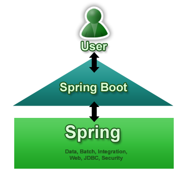
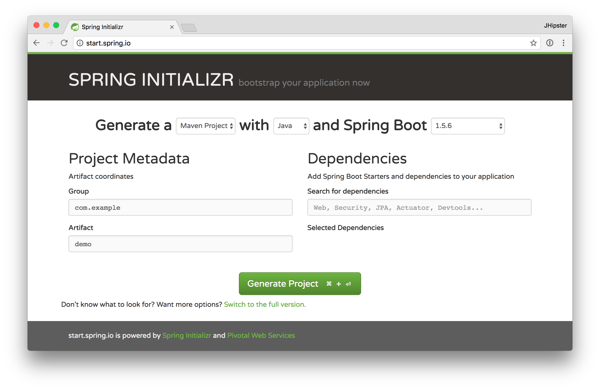
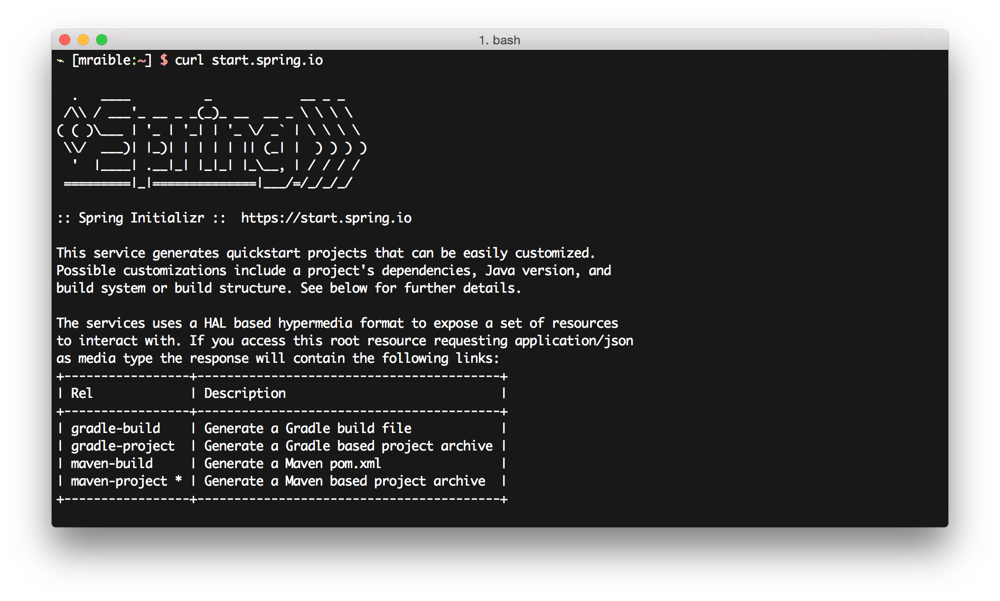

=== Spring Boot

In August 2013, the Phil Webb and Dave Syer, Engineers at Pivotal,
https://spring.io/blog/2013/08/06/spring-boot-simplifying-spring-for-everyone[announced the first milestone release] of Spring
Boot. Spring Boot makes it easy to create Spring applications with minimal effort. It takes an opinionated
view of Spring and auto-configures dependencies for you. This allows you to write less code, but still harness
the power of Spring. The diagram below shows how Spring Boot is the gateway to the larger Spring ecosystem.

[[img-spring-boot-pyramid]]
.Spring Boot

The primary goals of Spring Boot are:

* To provide a radically faster and widely accessible 'getting started' experience for all Spring development.
* To be opinionated out of the box, but get out of the way quickly as requirements start to diverge from the defaults.
* To provide a range of non-functional features that are common to large classes of projects
  (e.g. embedded servers, security, metrics, health checks, externalized configuration).

For folks wanting to use Spring Boot outside of a JHipster application, this can be done by using Spring Initializr.
Spring Initializr is a configurable service for generating Spring projects. It's both a web application and a REST API.
You can visit it in your browser at https://start.spring.io or you can call it via `curl`.

[[img-spring-initializr-web]]
.Spring Initializr in a browser

[[img-spring-initializr-curl]]
.Spring Initializr via curl

Spring Initializr is an Apache 2.0-licensed open source project that install and customize for generating Spring
projects for your company or team. You can find it on GitHub at https://github.com/spring-io/initializr.

Spring Initializr is also available in the Eclipse-based https://spring.io/tools/sts[Spring Tool Suite (STS)] and
https://www.jetbrains.com/idea/[IntelliJ IDEA].

.Spring CLI
****
At the bottom of the start.spring.io page, you can also download or install the Spring CLI (also called the Spring Boot CLI).
The easiest way to install it is using the following command.

----
curl https://start.spring.io/install.sh | sh
----

Spring CLI is best used for rapid prototyping; when you want to show someone how to do something _very_ quickly, and you'll
likely throw away the code when you're done. For example, if you want to create a "Hello World" web application in Groovy,
you can do it with seven lines of code.

[source,groovy]
.hello.groovy
----
@RestController
class WebApplication {
    @RequestMapping("/")
    String home() {
        "Hello World!"
    }
}
----

To compile and run this application, simply type:

----
spring run hello.groovy
----

After running this command, you can see the application at http://localhost:8080. For more information about the
Spring CLI, see the http://docs.spring.io/spring-boot/docs/current/reference/html/cli-using-the-cli.html[Spring Boot documentation].
****

To show you how to create a simple application with Spring Boot, go to https://start.spring.io and select `Web`, `JPA`,
`H2` and `Actuator` as project dependencies. Click *Generate Project* to download a .zip file for your project. Extract
it onto your hard drive and import it into your favorite IDE.

This project has only a few files in it, as you can see by running the `tree` command (on *nix).

----
.
├── pom.xml
└── src
    ├── main
    │   ├── java
    │   │   └── demo
    │   │       └── DemoApplication.java
    │   └── resources
    │       ├── application.properties
    │       ├── static
    │       └── templates
    └── test
        └── java
            └── demo
                └── DemoApplicationTests.java

10 directories, 4 files
----

`DemoApplication.java` is the heart of this application, the file and class name are not relevant. What is relevant
is the `@SpringBootApplication` annotation and the classes `public static void main`.

[source,java]
.src/main/java/demo/DemoApplication.java
----
package demo;

import org.springframework.boot.SpringApplication;
import org.springframework.boot.autoconfigure.SpringBootApplication;

@SpringBootApplication
public class DemoApplication {

    public static void main(String[] args) {
        SpringApplication.run(DemoApplication.class, args);
    }
}
----

For this application, you'll create an entity, a JPA repository and a REST endpoint to show data in the browser. To
create an entity, add the following code to the same `DemoApplication.java` file, outside of the `DemoApplication`
class.

[source,java]
----
@Entity
class Blog {

    @Id
    @GeneratedValue
    private Long id;
    private String name;

    public Long getId() {
        return id;
    }

    public void setId(Long id) {
        this.id = id;
    }

    public String getName() {
        return name;
    }

    public void setName(String name) {
        this.name = name;
    }

    @Override
    public String toString() {
        return "Blog{" +
                "id=" + id +
                ", name='" + name + '\'' +
                '}';
    }
}
----

----
interface BlogRepository extends JpaRepository<Blog, Long> {}
----

----
@Component
class BlogCommandLineRunner implements CommandLineRunner {

    @Override
    public void run(String... strings) throws Exception {
        System.out.println(repository.findAll());
    }

    @Autowired
    private BlogRepository repository;
}
----

[source,sql]
.src/main/resources/data.sql
----
insert into blog (name) values ('First');
insert into blog (name) values ('Second');
----

[source,java]
----
@RestController
class BlogController {

    @RequestMapping("/blogs")
    Collection<Blog> list() {
        return repository.findAll();
    }

    @Autowired
    BlogRepository repository;
}
----

----
mvn spring-boot:run
----

Or right-click and run from your IDE.

----
2015-09-21 06:00:07.056  INFO 6140 --- [           main] s.b.c.e.t.TomcatEmbeddedServletContainer : Tomcat started on port(s): 8080 (http)
[Blog{id=1, name='First'}, Blog{id=2, name='Second'}]
2015-09-21 06:00:07.210  INFO 6140 --- [           main] demo.DemoApplication                     : Started DemoApplication in 4.794 seconds (JVM running for 5.238)
----

----
$ curl localhost:8080/blogs
[{"id":1,"name":"First"},{"id":2,"name":"Second"}]
----

Spring has one of the best track records for hipness in JavaLand.

Create stand-alone Spring applications
Embeds Tomcat, Jetty or Undertow directly
Provides opinionated 'starter' POMs to simplify your Maven configuration
Also supports/promotes using Gradle

Automatically configures Spring whenever possible
Provides production-ready features such as metrics, health checks and externalized configuration
Absolutely no code generation and no requirement for XML configuration
Grails 3.0 is based on Spring Boot

... so that's pretty cool.

=== Maven vs. Gradle
=== IDE Support: Running, Debugging and Profiling

https://books.google.com/books?id=Pu53CgAAQBAJ&pg=PA258&lpg=PA258&dq=spring+initializr+netbeans&source=bl&ots=Bj-0d1AyZy&sig=D2A-eg7Gh6ssNiAD5LMQhDMsPqg&hl=en&sa=X&ved=0CCkQ6AEwAmoVChMIwIiZpISIyAIViU6SCh2GMA5C#v=onepage&q=spring%20initializr%20netbeans&f=false
https://blogs.oracle.com/geertjan/entry/new_spring_boot_integration_for

https://www.jetbrains.com/idea/help/creating-spring-boot-projects.html

=== Security
=== JPA vs. MongoDB vs. Cassandra
=== Liquibase
=== Elasticsearch
[[chapter4.websockets]]
=== Spring WebSockets

// Include simple Spring Security config and example

